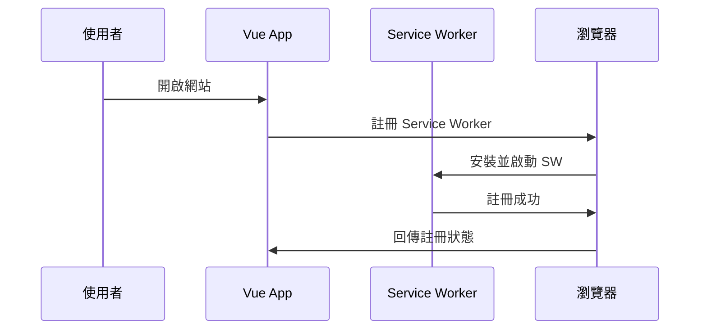
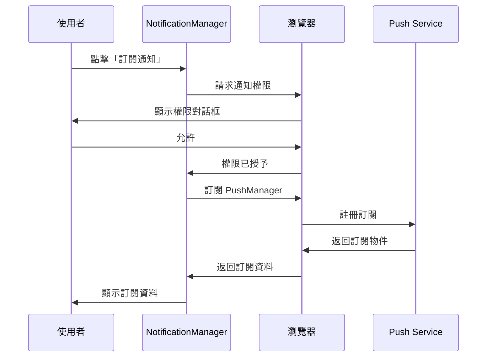
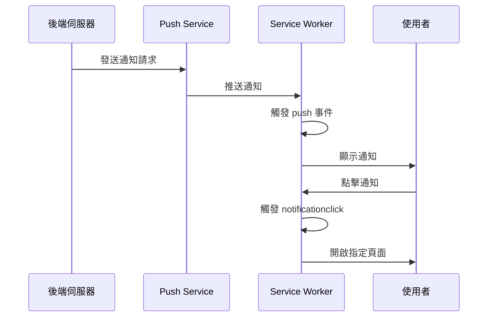

# WebNotifyApp 前端架構說明

## 專案概述

WebNotifyApp 是一個基於 Vue 3 + Vite 的 Web Push 通知系統，支援 PWA (Progressive Web App) 功能，讓使用者能夠訂閱並接收推播通知。

## 技術棧

- **框架**: Vue 3 (Composition API)
- **建置工具**: Vite
- **路由**: Vue Router (Hash Mode)
- **樣式**: Tailwind CSS v4
- **PWA**: vite-plugin-pwa
- **部署**: GitHub Pages

## 專案結構

```
frontend/
├── public/
│   ├── pwa-192x192.png          # PWA 圖示 (小)
│   └── pwa-512x512.png          # PWA 圖示 (大)
├── src/
│   ├── assets/                  # 靜態資源
│   ├── components/
│   │   └── NotificationManager.vue  # 通知訂閱管理元件
│   ├── views/
│   │   ├── Home.vue            # 首頁 (含分頁)
│   │   └── Announcement.vue    # 公告詳情頁
│   ├── router/
│   │   └── index.js            # 路由配置
│   ├── App.vue                 # 根元件
│   ├── main.js                 # 應用程式入口
│   ├── style.css               # 全域樣式
│   └── sw.js                   # Service Worker
├── vite.config.js              # Vite 配置
├── tailwind.config.js          # Tailwind 配置
└── postcss.config.js           # PostCSS 配置
```

## 核心功能流程

### 1. Service Worker 註冊



**實作位置**: `vite.config.js` (透過 vite-plugin-pwa 自動處理)

### 2. 通知訂閱流程



**實作位置**: `src/components/NotificationManager.vue`

### 3. 接收通知流程



**實作位置**: `src/sw.js`

## 元件說明

### App.vue
**職責**: 應用程式的根元件，負責渲染路由視圖。

```vue
<template>
  <router-view></router-view>
</template>
```

**特點**:
- 極簡設計，所有佈局邏輯移至各個 View
- 使用 `<router-view>` 動態渲染頁面

---

### Home.vue
**職責**: 首頁，包含「訂閱」和「公告」兩個分頁。

**功能**:
1. **分頁切換**: 使用 `activeTab` 狀態控制
2. **訂閱分頁**: 嵌入 `NotificationManager` 元件
3. **公告分頁**: 顯示公告列表，點擊後導航至詳情頁

**狀態管理**:
```javascript
const activeTab = ref('subscription')  // 當前分頁
const announcements = ref([...])       // 公告資料
```

**路由導航**:
```javascript
const goToAnnouncement = (id) => {
  router.push(`/announcement/${id}`)
}
```

---

### Announcement.vue
**職責**: 公告詳情頁，顯示單一公告的完整內容。

**功能**:
1. 從路由參數取得公告 ID: `$route.params.id`
2. 顯示公告內容 (目前為靜態範例)
3. 提供「返回首頁」按鈕

**未來擴充**:
- 從 API 取得公告資料
- 支援 Markdown 渲染
- 加入分享功能

---

### NotificationManager.vue
**職責**: 處理通知訂閱的核心元件。

**功能**:
1. **檢查支援度**: 確認瀏覽器是否支援 Service Worker 和 Push API
2. **請求權限**: 向使用者請求通知權限
3. **訂閱通知**: 使用 VAPID 公鑰訂閱 PushManager
4. **顯示訂閱資料**: 將訂閱物件以 JSON 格式顯示

**關鍵方法**:

#### `requestPermission()`
```javascript
async requestPermission() {
  const permission = await Notification.requestPermission()
  if (permission === 'granted') {
    await this.subscribeUser()
  }
}
```

#### `subscribeUser()`
```javascript
async subscribeUser() {
  const registration = await navigator.serviceWorker.ready
  const subscription = await registration.pushManager.subscribe({
    userVisibleOnly: true,
    applicationServerKey: this.urlBase64ToUint8Array(VAPID_PUBLIC_KEY)
  })
  this.subscription = JSON.stringify(subscription, null, 2)
}
```

**狀態**:
- `isSupported`: 瀏覽器是否支援
- `permission`: 當前權限狀態
- `subscription`: 訂閱資料 (JSON 字串)

---

## 路由配置

**檔案**: `src/router/index.js`

**模式**: Hash Mode (`createWebHashHistory`)
- 原因: GitHub Pages 不支援 HTML5 History Mode 的 SPA 路由
- URL 格式: `https://example.com/#/announcement/123`

**路由表**:
```javascript
const routes = [
  {
    path: '/',
    name: 'Home',
    component: Home
  },
  {
    path: '/announcement/:id',
    name: 'Announcement',
    component: Announcement
  }
]
```

---

## Service Worker 邏輯

**檔案**: `src/sw.js`

### 事件監聽

#### 1. `push` 事件
**觸發時機**: 收到推播通知時

```javascript
self.addEventListener('push', (event) => {
  const data = event.data.json()
  const options = {
    body: data.body,
    icon: '/pwa-192x192.png',
    badge: '/pwa-192x192.png',
    data: { url: data.url }
  }
  event.waitUntil(
    self.registration.showNotification(data.title, options)
  )
})
```

#### 2. `notificationclick` 事件
**觸發時機**: 使用者點擊通知時

```javascript
self.addEventListener('notificationclick', (event) => {
  event.notification.close()
  const urlToOpen = event.notification.data.url || '/'
  event.waitUntil(
    clients.openWindow(urlToOpen)
  )
})
```

---

## PWA 配置

**檔案**: `vite.config.js`

### Manifest 設定
```javascript
manifest: {
  name: 'WebNotifyApp',
  short_name: 'NotifyApp',
  description: 'Web Push Notification System',
  theme_color: '#3b82f6',
  icons: [
    {
      src: 'pwa-192x192.png',
      sizes: '192x192',
      type: 'image/png'
    },
    {
      src: 'pwa-512x512.png',
      sizes: '512x512',
      type: 'image/png'
    }
  ]
}
```

### Service Worker 策略
```javascript
workbox: {
  globPatterns: ['**/*.{js,css,html,ico,png,svg}']
}
```

---

## 樣式系統

### Tailwind CSS v4
**配置**: `postcss.config.js`

```javascript
export default {
  plugins: {
    '@tailwindcss/postcss': {},
    autoprefixer: {},
  },
}
```

**引入**: `src/style.css`
```css
@import "tailwindcss";
```

### 設計系統

**色彩**:
- 主色: `blue-600` (#3b82f6)
- 輔色: `teal-400` (#2dd4bf)
- 背景: `gray-50` (#f9fafb)

**字體**:
- 標題: `text-4xl font-extrabold`
- 內文: `text-gray-600`

---

## 建置與部署

### 開發環境
```bash
npm run dev
```
- 啟動開發伺服器
- 支援 HMR (熱模組替換)
- 預設 port: 5131

### 生產建置
```bash
npm run build
```
- 輸出目錄: `dist/`
- 自動產生 Service Worker
- 最佳化資源

### GitHub Pages 部署
**自動化**: `.github/workflows/deploy.yml`

**關鍵配置**:
```javascript
// vite.config.js
export default defineConfig({
  base: '/WebNotifyApp/',  // GitHub Pages 子路徑
  // ...
})
```

---

## 資料流向

### 訂閱資料流
```
使用者點擊訂閱
    ↓
NotificationManager 請求權限
    ↓
瀏覽器顯示權限對話框
    ↓
使用者允許
    ↓
訂閱 PushManager (使用 VAPID 公鑰)
    ↓
Push Service 返回訂閱物件
    ↓
顯示在畫面上 (JSON 格式)
    ↓
複製到 send-test-push.js
```

### 通知資料流
```
後端發送通知 (使用 VAPID 私鑰)
    ↓
Push Service 驗證並轉發
    ↓
Service Worker 接收 push 事件
    ↓
顯示通知 (含標題、內容、圖示)
    ↓
使用者點擊通知
    ↓
Service Worker 處理 notificationclick
    ↓
開啟指定 URL (例如公告詳情頁)
```

---

## 瀏覽器相容性

| 功能 | Chrome | Firefox | Safari | Edge |
|------|--------|---------|--------|------|
| Service Worker | ✅ | ✅ | ✅ (iOS 16.4+) | ✅ |
| Push API | ✅ | ✅ | ✅ (iOS 16.4+) | ✅ |
| Notification API | ✅ | ✅ | ✅ (iOS 16.4+) | ✅ |

### iOS 特別注意事項
- 必須將網站「加入主畫面」才能訂閱通知
- 不支援在一般瀏覽器分頁中訂閱
- 需要 iOS 16.4 或更高版本

---

## 開發注意事項

### 1. VAPID 公鑰位置
**檔案**: `src/components/NotificationManager.vue`
```javascript
const VAPID_PUBLIC_KEY = 'BKKNwQVSB2ygXyF0p5Q5aLzuClvF9IgJR97ZilT4SmZ0OBDmjap_gGxpszUKXybnl7jZ1ATS7z1VYO6CWJ1u8KQ'
```

### 2. 路由模式
- 使用 Hash Mode 以支援 GitHub Pages
- URL 會包含 `#` 符號
- 不影響功能，但 URL 較不美觀

### 3. Service Worker 更新
- 修改 `sw.js` 後需要重新建置
- 瀏覽器可能會快取舊版 Service Worker
- 開發時建議在 DevTools 勾選 "Update on reload"

### 4. 本機測試限制
- Service Worker 需要 HTTPS 或 localhost
- Push API 需要有效的 VAPID 金鑰
- 通知權限一旦拒絕，需手動在瀏覽器設定中重置

---

## 未來擴充方向

### 短期
- [ ] 加入取消訂閱功能
- [ ] 公告資料改為從 API 取得
- [ ] 支援多語系 (i18n)

### 中期
- [ ] 建立後端 API (Vercel Serverless Functions)
- [ ] 儲存訂閱資料到資料庫
- [ ] 建立管理後台發送通知

### 長期
- [ ] 支援通知分類 (訂閱特定主題)
- [ ] 加入通知歷史記錄
- [ ] 支援富文本通知 (圖片、按鈕)

---

## 疑難排解

### 問題: Service Worker 註冊失敗
**解決方案**:
1. 確認使用 HTTPS 或 localhost
2. 檢查瀏覽器 Console 錯誤訊息
3. 清除瀏覽器快取並重新載入

### 問題: 訂閱失敗
**解決方案**:
1. 確認 VAPID 公鑰格式正確
2. 檢查通知權限是否被拒絕
3. 確認 Service Worker 已成功註冊

### 問題: 通知無法顯示
**解決方案**:
1. 檢查系統通知設定
2. 確認瀏覽器通知權限
3. 驗證後端發送的資料格式

### 問題: GitHub Pages 顯示 404
**解決方案**:
1. 確認 `vite.config.js` 的 `base` 設定正確
2. 確認路由使用 Hash Mode
3. 檢查 GitHub Pages 設定為 "GitHub Actions"

---

## 參考資源

- [Vue 3 官方文件](https://vuejs.org/)
- [Vite 官方文件](https://vitejs.dev/)
- [Web Push API (MDN)](https://developer.mozilla.org/en-US/docs/Web/API/Push_API)
- [Service Worker API (MDN)](https://developer.mozilla.org/en-US/docs/Web/API/Service_Worker_API)
- [vite-plugin-pwa](https://vite-pwa-org.netlify.app/)
