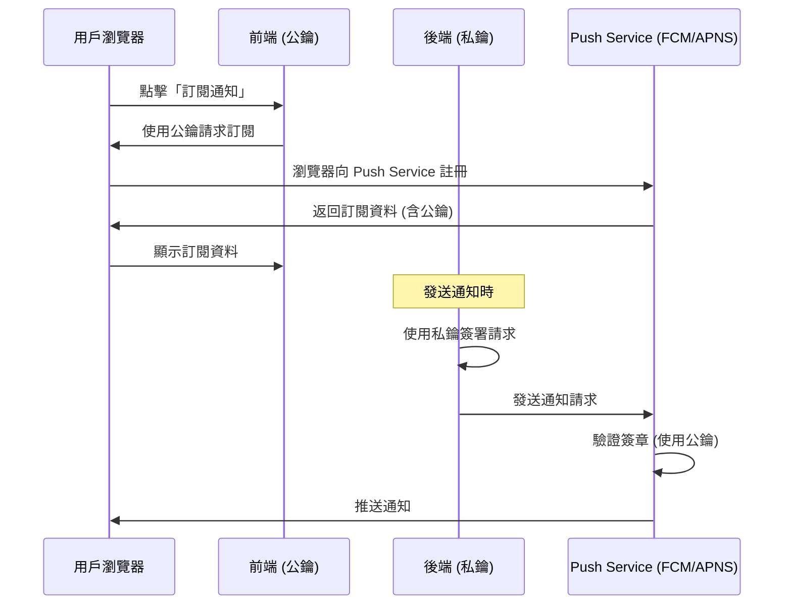

# VAPID 金鑰說明文件

## 什麼是 VAPID 金鑰？

VAPID (Voluntary Application Server Identification) 金鑰是 Web Push 通知系統的身份驗證機制。它由一對公鑰和私鑰組成，用來證明「是您的應用程式」在發送通知。

## 金鑰的角色

### 公鑰 (Public Key)
- **位置**：前端 (`frontend/src/components/NotificationManager.vue`)
- **用途**：告訴瀏覽器「誰」有權限發送通知給訂閱者
- **安全性**：可以公開，會被包含在前端程式碼中
- **作用**：用戶訂閱時，瀏覽器會將這個公鑰綁定到訂閱資料中

### 私鑰 (Private Key)
- **位置**：後端 (`send-test-push.js` 或未來的後端 API)
- **用途**：簽署發送通知的請求，證明請求來自合法的伺服器
- **安全性**：**絕對機密**，不可外洩或提交到 Git
- **作用**：只有持有私鑰的伺服器才能發送通知

## 如何產生新的金鑰對

### 方法 1：使用 web-push CLI (推薦)

```bash
npx web-push generate-vapid-keys
```

輸出範例：
```
=======================================

Public Key:
BKKNwQVSB2ygXyF0p5Q5aLzuClvF9IgJR97ZilT4SmZ0OBDmjap_gGxpszUKXybnl7jZ1ATS7z1VYO6CWJ1u8KQ

Private Key:(私鑰)


=======================================
```

### 方法 2：使用 Node.js 腳本

創建 `generate-vapid.js`：
```javascript
const webpush = require('web-push');
const vapidKeys = webpush.generateVAPIDKeys();

console.log('Public Key:', vapidKeys.publicKey);
console.log('Private Key:', vapidKeys.privateKey);
```

執行：
```bash
node generate-vapid.js
```

## 更新金鑰的步驟

> [!WARNING]
> 更換金鑰會使所有現有訂閱失效！用戶需要重新訂閱。

### 步驟 1：產生新金鑰
```bash
npx web-push generate-vapid-keys
```

### 步驟 2：更新前端
編輯 `frontend/src/components/NotificationManager.vue`：
```javascript
const VAPID_PUBLIC_KEY = '您的新公鑰'
```

### 步驟 3：更新後端
編輯 `send-test-push.js`：
```javascript
const publicVapidKey = '您的新公鑰';
const privateVapidKey = '您的新私鑰';
```

### 步驟 4：重新部署
```bash
# 前端
cd frontend
npm run build
git add .
git commit -m "Update VAPID keys"
git push
```

### 步驟 5：用戶重新訂閱
- 舊的訂閱會失效
- 用戶需要在網站上重新點擊「訂閱通知」
- 取得新的訂閱資料並更新到 `send-test-push.js`

## 安全最佳實踐

### ✅ 應該做的事
1. **私鑰保密**：絕不將私鑰提交到 Git 或公開分享
2. **環境變數**：在正式環境中，使用環境變數儲存私鑰
3. **定期輪換**：建議每年更換一次金鑰
4. **備份金鑰**：將金鑰安全地備份到密碼管理器

### ❌ 不應該做的事
1. 不要在前端使用私鑰
2. 不要將私鑰硬編碼在程式碼中（正式環境）
3. 不要與他人共享私鑰
4. 不要在公開的 GitHub 儲存庫中提交私鑰

## 使用環境變數 (生產環境建議)

### 後端範例 (Node.js)
```javascript
// send-test-push.js
const publicVapidKey = process.env.VAPID_PUBLIC_KEY;
const privateVapidKey = process.env.VAPID_PRIVATE_KEY;

webpush.setVapidDetails(
  'mailto:your-email@example.com',
  publicVapidKey,
  privateVapidKey
);
```

### 設定環境變數
```bash
# .env 檔案 (不要提交到 Git)
VAPID_PUBLIC_KEY=您的公鑰
VAPID_PRIVATE_KEY=您的私鑰
```

### .gitignore 設定
確保 `.gitignore` 包含：
```
.env
.env.*
send-test-push.js
```

## 金鑰的運作流程



## 常見問題

### Q: 我可以使用別人的金鑰嗎？
**A:** 技術上可以，但強烈不建議。這樣別人就能假冒您的名義發送通知。

### Q: 金鑰遺失了怎麼辦？
**A:** 重新產生一組新的金鑰，並要求所有用戶重新訂閱。

### Q: 公鑰被看到會有安全問題嗎？
**A:** 不會。公鑰設計上就是要公開的，只要私鑰安全即可。

### Q: 一個應用程式可以有多組金鑰嗎？
**A:** 可以，但每個訂閱只能對應一組金鑰。通常一個應用程式使用一組即可。

## 目前專案的金鑰位置

| 檔案 | 金鑰類型 | 說明 |
|------|---------|------|
| `frontend/src/components/NotificationManager.vue` | 公鑰 | 第 48 行 `VAPID_PUBLIC_KEY` |
| `send-test-push.js` | 公鑰 + 私鑰 | 第 14-15 行 |

> [!CAUTION]
> 目前的金鑰是測試用途。正式上線前，請產生新的金鑰並使用環境變數管理。
